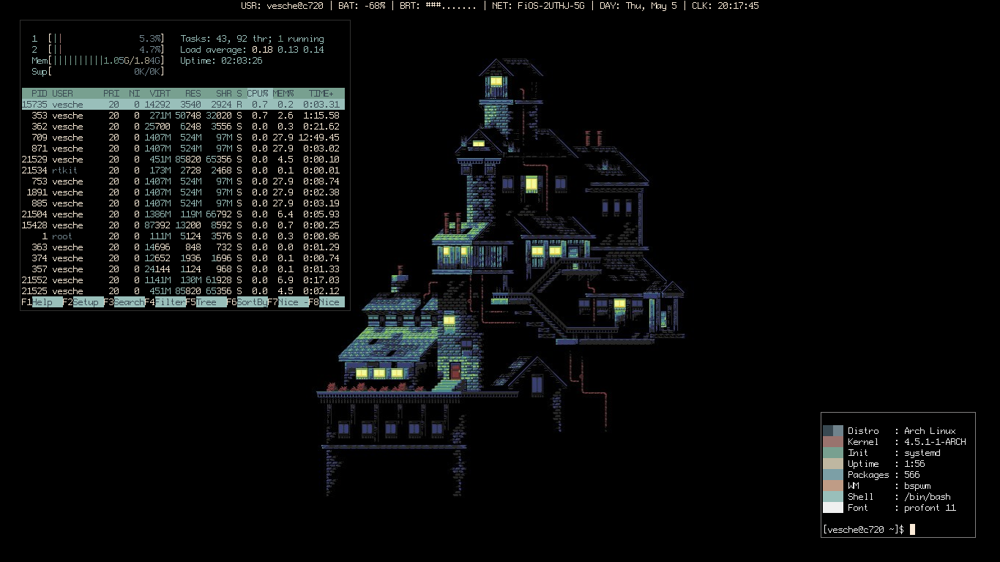

These are old, I've been using a Lenovo ThinkPad T480 as of late 2018. [t480 dotfiles repo here](https://github.com/vesche/t480).

My dotfiles. I keep it simple stupid and very minimal.

* Hardware (Laptop): [Acer C720](http://a.co/b6lg7tR)
* Hardware (Desktop): [Intel NUC](https://www.intel.com/content/www/us/en/products/boards-kits/nuc.html)
* OS: [Arch Linux](https://www.archlinux.org/)
* Window Manager: [bspwm](https://github.com/baskerville/bspwm)
* Terminal: [urxvt](https://wiki.archlinux.org/index.php/Rxvt-unicode) ([rxvt-unicode-patched](https://aur.archlinux.org/packages/rxvt-unicode-patched/))
* Shell: [bash](https://www.gnu.org/software/bash/)
* Font (Laptop): [Source Code Pro](https://github.com/adobe-fonts/source-code-pro)
* Font (Desktop): [ProFont](https://en.wikipedia.org/wiki/ProFont) (Desktop)
* Text Editor: [vim](https://www.vim.org/) & [Virtual Studio Code](https://code.visualstudio.com/)
* Web Browser: [Firefox](https://www.mozilla.org/en-US/firefox/new/)
    * [Stylish](https://addons.mozilla.org/en-US/firefox/addon/stylish/)
    * [uBlock Origin](https://addons.mozilla.org/en-US/firefox/addon/ublock-origin/)
    * [Imagus](https://addons.mozilla.org/en-US/firefox/addon/imagus/)
    * [Dark Reader](https://addons.mozilla.org/en-US/firefox/addon/darkreader/)
* Bar (Desktop): [polybar](https://github.com/jaagr/polybar)
* Bar (Laptop): [lemonbar](https://github.com/LemonBoy/bar) ([lemonbar-xft-git](https://aur.archlinux.org/packages/lemonbar-xft-git/))
* Launcher: [dmenu](https://wiki.archlinux.org/index.php/Dmenu)
* Background: [nitrogen](https://wiki.archlinux.org/index.php/Nitrogen)

### Desktop

### Laptop

